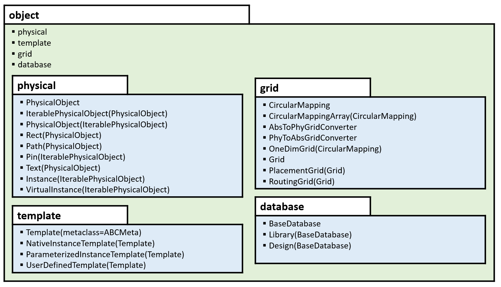

# Laygo2 사용자 안내서 (한글) 
**Laygo User Manual (Korean)**

작성자: 한재덕 (jdhan at hanyang dot ac dot kr)

## 서론
이 사용자 안내서는 레이아웃 스크립팅 및 자동생성 프레임웍인 Laygo2의 사용을 돕기 위하여 작성되었다.
Laygo는 본래 커스텀 집적회로 자동생성 프레임웍인 Berkeley Analog Generator 2 (BAG2)의 
레이아웃 생성 엔진으로 개발되었으며[관련자료], Laygo의 기능을 보완 확장하여 Laygo2가 개발되었다.
Laygo2는 단독 또는 BAG2와 결합한 형태로 실행이 모두 가능하다.

**Laygo2는 다음과 같은 환경에서의 IC레이아웃 작업에 최적화되어 있다.**

1. 레이아웃 설계 과정의 자동화 및 재사용
1. 파라미터 기반 레이아웃 생성
1. FinFET등의 미소 공정용 레이아웃
1. 코드 기반 레이아웃 작업

**기존 Laygo와 Laygo2가 공통적으로 갖는 특징들은 다음과 같다.**
1. **템플릿과 그리드 기반 소자 배치**: 공정 별로 고유의 소자 인스턴스 및 좌표값들(physical 
coordinates) 직접 사용하지 않고, 템플릿 형태로 추상화 된 인스턴스 및 추상화된 격자(그리드, grid)의 
사용으로, 레이아웃 생성 코드의 이식성 및 재사용성을 높였다.
1. **상대적인 정보에 기반한 배치**: 생성된 인스턴스들을 배치할 때, 인스턴스 간의 상대적인 정보
(relative information)을 활용하여, 매우 높은 수준의 추상화를 달성하여 코드의 공정 이식성을 극대화하였다.
1. **그리드 기반 배선**: 라우팅 배선들도 공정 독립적인 추상화 된 격자들 위에 배치하도록 배선 함수들을
구현함으로서, 배선 작업의 공정 이식성을 향상하였다.                                                                                                                                                                                                                                                                                                                                                                                                                                                                                                                                                                                                                                                                                                                                                                                                                                                                                                                                                                                                                                                                                                                                                                                                                                                                                                                                                                                                                                                                                                                                                                                                                                                                                                                                                                                                                                                                                                                                                                   

**기존 Laygo와 비교하여 Laygo2가 갖는 장점은 다음과 같다.**
1. **객체 지향 요소의 강화**: 모듈간 의존성을 최소화하여, 이식성과 재사용성을 증대하고, 
객체 지향 프로그래밍 기법을 활용하여 레이아웃 생성 과정을 기술할 수 있도록 하였다.
일례로, Physical 모듈의 클래스들은 다른 모듈들과 독립적으로 사용이 가능하며, Template 클래스들은 
기존에 정의된 클래스들을 상속하는 방식으로 재정의 및 확장이 가능하도록 설계되어 있다.
1. **정수 기반 좌표 연산**: 실수 기반 좌표 연산에서 정수 기반 좌표 연산으로 변경하여 실수 연산 
과정에서의 오동작 가능성을 최소화하였다. 정수 기반으로 계산된 좌표들은 최종 입출력 시에만 scale 값에
따라 실제 값들로 변환된다.
1. **향상된 템플릿 생성 기능 제공**: 기존의 싱글 인스턴스 기반 템플릿 (NativeInstanceTemplate)에 
추가로, PCell기반 템플릿 또는, 사용자 정의형 템플릿 클래스 (UserdefinedTemplate)을 제공하여 좀 더 
다양한 형태의 템플릿 정의 및 인스턴스 생성이 가능해졌다. 이외에 사용자가 추상화 클래스를 
상속하는 방법으로 새로운 템플릿 클래스를 생성할 수도 있다. 
1. **향상된 인스턴스 및 그리드 인덱싱 시스템 제공**: 이제 인스턴스와 그리드 객체들은 Numpy array에 
더욱 밀접하게 통합되어 더 쉬운 인덱싱 및 슬라이싱 기능 제공. 그리드의 경우는 기존 Numpy array를 
확장하여 그리드가 정의된 범위를 넘어선 제한 없는 인덱싱 가능.
1. 코드 전반에 걸친 개선이 이루어졌다.
1. (예정) 더 많은 문서와 테스트가 추가되었다.
1. (예정) 제네레이터 리포지토리를 프레임웍에서 분리하였다.
1. (예정) 멀티 패터닝을 지원한다.

## 쉬운 예제들
Laygo2의 구조 및 동작 방식에 대해 본격적인 설명에 앞서, Laygo2의 대략적인 동작에 대한 이해를 돕기 위한 예제들이
[이 문서](2_examples.md)에 소개되어 있다.

## Laygo2의 구조
Laygo2를 구성하는 패키지 및 모듈들의 구조가 [이 문서](3_structure.md)에 서술되어 있다.

## Laygo2의 동작 방식
1. 공정 파라미터, 기존 템플릿, 그리드 불러오기
1. 템플릿에서 인스턴스 생성
1. 생성된 인스턴스의 배치
1. 인스턴스간 Wire 및 Via 라우팅
1. 핀 생성
1. 생성된 레이아웃을 적절한 포맷으로 출력
1. (선택사항) 생성된 레이아웃을 새로운 템플릿으로 저장

## 신규 공정에서의 Laygo2 설치

## 개발자 목록

## 라이센싱 및 배포, 개발 기여
Laygo2는 BSD라이센스 형태로 배포되며, 오픈소스의 형태로 개발된다.

